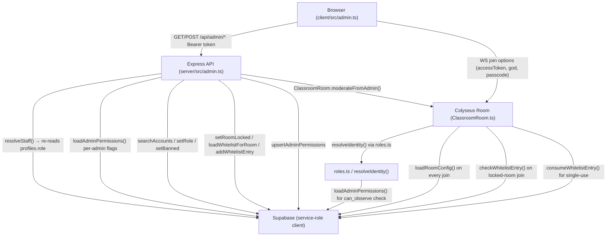
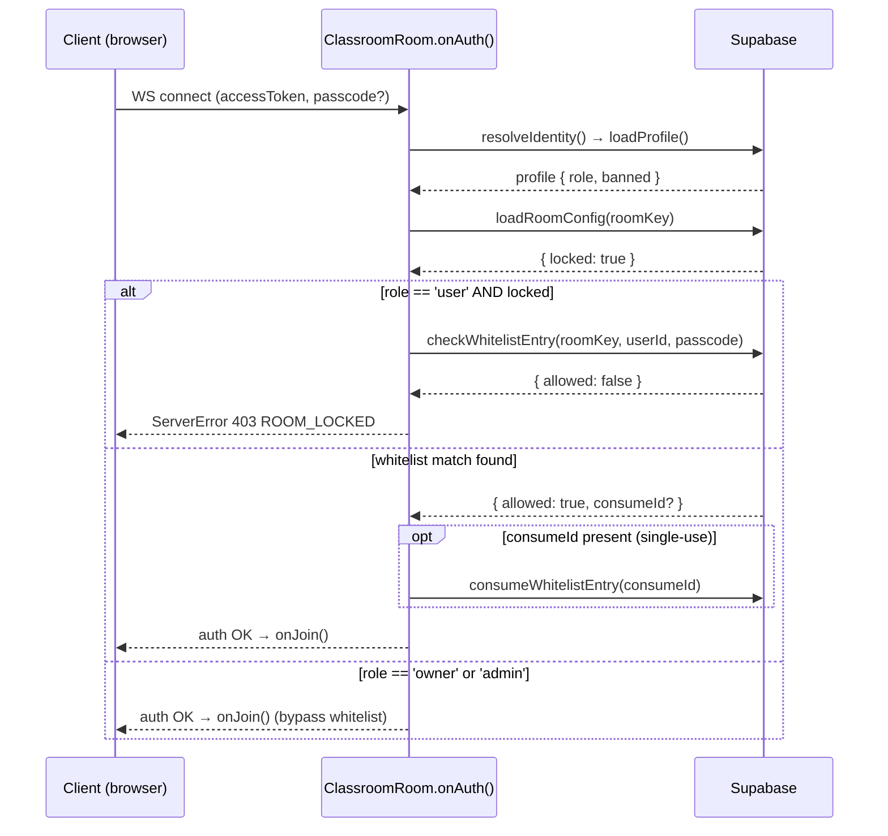
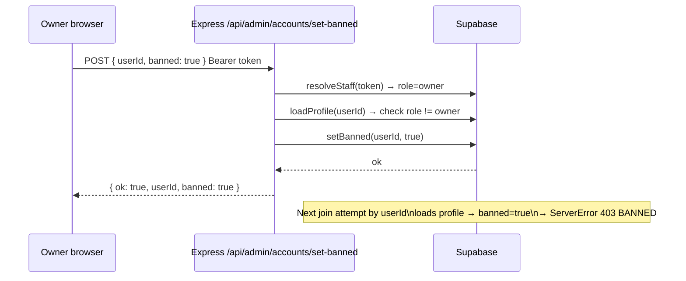
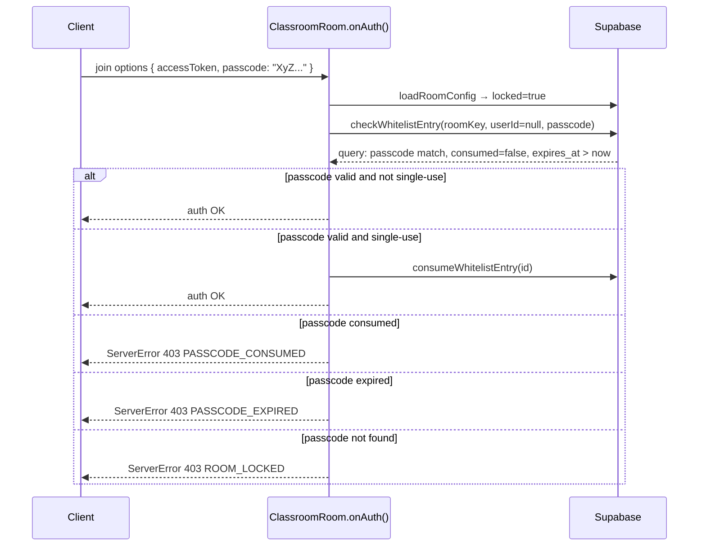
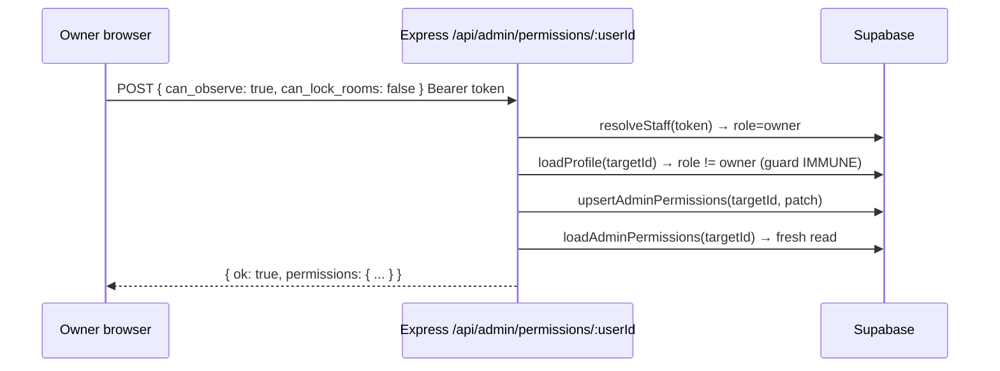

# Design Document: Admin Dashboard Enhancements

## Overview

This feature adds seven capabilities to the Klase admin dashboard: offline account promote/demote via account search, admin silent observation (gated by `can_observe`), owner-configurable per-admin permission flags, room locking backed by a per-room whitelist, a unified ban/blacklist flow, whitelist management (user-id and passcode entries), and a cross-room Player Tracker modal.

All permission enforcement is server-side. The client UI is cosmetic — it shows or hides controls based on the server-reported role and permission flags, but the server re-reads the database on every request and ignores any client-supplied permission claims.

The implementation is additive: no existing tables are dropped, no existing endpoints are removed. All new DB objects are already present in `docs/supabase.sql` (the schema is ahead of the server code in some areas).

---

## Architecture



---

## Database Schema

All tables already exist in `docs/supabase.sql`. Exact DDL for reference:

```sql
-- Per-admin permission flags (already in supabase.sql)
CREATE TABLE IF NOT EXISTS public.admin_permissions (
  user_id      uuid PRIMARY KEY REFERENCES auth.users(id) ON DELETE CASCADE,
  can_observe  boolean NOT NULL DEFAULT false,
  can_lock_rooms boolean NOT NULL DEFAULT false,
  can_blacklist  boolean NOT NULL DEFAULT false,
  can_announce   boolean NOT NULL DEFAULT false,
  updated_at   timestamptz NOT NULL DEFAULT now()
);
ALTER TABLE public.admin_permissions ENABLE ROW LEVEL SECURITY;
-- No client RLS policies; all access via service_role.

-- Room lock config (already in supabase.sql)
CREATE TABLE IF NOT EXISTS public.room_config (
  room_key      text PRIMARY KEY CHECK (room_key IN ('klase-1','klase-2','klase-3')),
  locked        boolean NOT NULL DEFAULT false,
  whitelist_mode boolean NOT NULL DEFAULT false,
  updated_at    timestamptz NOT NULL DEFAULT now()
);
ALTER TABLE public.room_config ENABLE ROW LEVEL SECURITY;

-- Seed rows (idempotent)
INSERT INTO public.room_config (room_key)
VALUES ('klase-1'), ('klase-2'), ('klase-3')
ON CONFLICT (room_key) DO NOTHING;

-- Per-room whitelist (already in supabase.sql)
CREATE TABLE IF NOT EXISTS public.whitelist (
  id          uuid PRIMARY KEY DEFAULT gen_random_uuid(),
  room_key    text NOT NULL CHECK (room_key IN ('klase-1','klase-2','klase-3')),
  user_id     uuid REFERENCES auth.users(id) ON DELETE CASCADE,
  passcode    text UNIQUE,
  label       text NOT NULL DEFAULT '',
  single_use  boolean NOT NULL DEFAULT false,
  consumed    boolean NOT NULL DEFAULT false,
  expires_at  timestamptz,
  added_by    uuid REFERENCES auth.users(id) ON DELETE SET NULL,
  created_at  timestamptz NOT NULL DEFAULT now(),
  CONSTRAINT whitelist_has_key CHECK (user_id IS NOT NULL OR passcode IS NOT NULL)
);
ALTER TABLE public.whitelist ENABLE ROW LEVEL SECURITY;

CREATE INDEX IF NOT EXISTS whitelist_room_user
  ON public.whitelist (room_key, user_id) WHERE user_id IS NOT NULL;
CREATE INDEX IF NOT EXISTS whitelist_passcode
  ON public.whitelist (passcode) WHERE passcode IS NOT NULL;
```

The `profiles` table already has `banned boolean NOT NULL DEFAULT false` and `role text`.

New shared error codes to add to `shared/src/index.ts`:
```typescript
export const ERROR_ROOM_LOCKED    = "ROOM_LOCKED";
export const ERROR_PASSCODE_CONSUMED = "PASSCODE_CONSUMED";
export const ERROR_PASSCODE_EXPIRED  = "PASSCODE_EXPIRED";
```

---

## API Endpoint Table

All endpoints are under `/api/admin/*` and require a valid `Authorization: Bearer <access_token>` header. `requireStaff` middleware re-reads `profiles.role` on every call.

| Method | Path | Auth | Request Body | Response |
|--------|------|------|-------------|----------|
| GET | `/api/admin/me` | owner \| admin | — | `{ name, role, permissions? }` |
| GET | `/api/admin/rooms` | owner \| admin | — | `{ rooms: RoomInfo[] }` |
| POST | `/api/admin/moderate` | owner \| admin | `{ roomKey, action, targetId?, targetIds?, reason?, message?, cooldownSec?, permanent? }` | `{ ok: true }` |
| GET | `/api/admin/accounts?q=` | **owner only** | — | `{ accounts: AccountSearchResult[] }` |
| POST | `/api/admin/accounts/set-role` | **owner only** | `{ userId, role: 'admin'\|'user' }` | `{ ok, userId, role }` |
| POST | `/api/admin/accounts/set-banned` | owner \| admin(`can_blacklist`) | `{ userId, banned: bool }` | `{ ok, userId, banned }` |
| GET | `/api/admin/permissions` | **owner only** | — | `{ permissions: AdminPermissions[] }` |
| POST | `/api/admin/permissions/:userId` | **owner only** | `{ can_observe?, can_lock_rooms?, can_blacklist?, can_announce? }` | `{ ok, permissions }` |
| GET | `/api/admin/room-config` | owner \| admin | — | `{ configs: RoomConfig[] }` (already via `/rooms`) |
| POST | `/api/admin/room-config` | owner \| admin(`can_lock_rooms`) | `{ roomKey, locked: bool }` | `{ ok, roomKey, locked }` |
| GET | `/api/admin/whitelist/:roomKey` | owner \| admin | — | `{ entries: WhitelistEntry[] }` (passcode masked for non-owner) |
| POST | `/api/admin/whitelist/:roomKey/add` | owner \| admin(`can_lock_rooms`) | `{ type: 'user'\|'passcode', user_id?, label?, single_use?, expires_at? }` | `{ entry }` |
| DELETE | `/api/admin/whitelist/entry/:id` | owner \| admin(`can_lock_rooms`) | — | `{ ok: true }` |

**Error codes returned** (existing + new):

| Code | HTTP | Meaning |
|------|------|---------|
| `AUTH` | 401 | Missing/invalid bearer token |
| `BANNED` | 403 | Account is banned |
| `NO_PERMISSION` | 403 | Missing role or admin flag |
| `IMMUNE` | 403 | Target is the owner account |
| `ADMIN_VS_ADMIN` | 403 | Admin tried to moderate admin |
| `NOT_FOUND` | 404 | Target player/room not found |
| `ROOM_FULL` | 403 | Room at capacity |
| `BAD_REQUEST` | 400 | Malformed input or no-op |
| `SERVER` | 500 | Unexpected server error |
| `ROOM_LOCKED` | 403 | Room locked, join denied |
| `PASSCODE_CONSUMED` | 403 | Single-use passcode already used |
| `PASSCODE_EXPIRED` | 403 | Passcode past `expires_at` |

---

## Server Module Responsibilities

### `server/src/supabase.ts` (modified)

Already contains all required functions. The following are already implemented:
- `loadAdminPermissions(userId)` / `loadAllAdminPermissions()` / `upsertAdminPermissions()` / `ensureAdminPermissionsRow()`
- `loadRoomConfig(roomKey)` / `loadAllRoomConfigs()` / `setRoomLocked()`
- `loadWhitelistForRoom()` / `checkWhitelistEntry()` / `consumeWhitelistEntry()` / `addWhitelistEntry()` / `removeWhitelistEntry()`
- `searchAccounts(query, limit)`

**Remaining gap:** `searchAccounts` is already implemented as `searchAccounts` (not `searchProfiles`). No rename needed.

### `server/src/roles.ts` (modified)

`resolveIdentity()` already has the room-lock + whitelist check logic. The `can_observe` check for admins requesting god mode is already present. No further changes required to the core flow.

### `server/src/admin.ts` (modified)

Already contains all routes listed in the API table above. Existing routes:
- `GET /api/admin/me` ✓
- `GET /api/admin/rooms` ✓ (includes lock state)
- `POST /api/admin/moderate` ✓ (with `can_announce` guard for admins)
- `POST /api/admin/room-config` ✓
- `GET /api/admin/whitelist/:roomKey` ✓
- `POST /api/admin/whitelist/:roomKey/add` ✓
- `DELETE /api/admin/whitelist/entry/:id` ✓
- `GET /api/admin/accounts` ✓
- `POST /api/admin/accounts/set-role` ✓
- `POST /api/admin/accounts/set-banned` ✓
- `GET /api/admin/permissions` ✓
- `POST /api/admin/permissions/:userId` ✓

**Remaining gap:** `GET /api/admin/room-config` as a standalone endpoint is not needed — room config is already embedded in `GET /api/admin/rooms` response.

### `server/src/ClassroomRoom.ts` (modified)

`onAuth()` already performs:
1. `loadRoomConfig(roomKey)` on every join
2. `checkWhitelistEntry(roomKey, userId, passcode)` when locked
3. `consumeWhitelistEntry(consumeId)` for single-use passcodes
4. Throws `ServerError(403, JSON.stringify({ error: "ROOM_LOCKED", ... }))` when denied

**Remaining gap:** The error code format. Currently uses `JSON.stringify({ error: "ROOM_LOCKED", message: "..." })`. The shared constant `ERROR_ROOM_LOCKED` should be used. Also, `PASSCODE_CONSUMED` and `PASSCODE_EXPIRED` are not yet thrown as distinct errors — the current code treats expired/consumed entries as simply "not found", returning `ROOM_LOCKED`. These need to be surfaced as distinct codes if the client needs to display different messages.

### `client/src/admin.ts` (modified)

Currently renders: Enter-as identity, room cards with player list and moderation toolbar.

**New sections to add:**

1. **Accounts section** (owner only): search input → result list with promote/demote and blacklist buttons
2. **Admin Permissions panel** (owner only): list of admin accounts, each with four toggle checkboxes
3. **Room lock controls** (owner + admin with `can_lock_rooms`): lock/unlock button per room card, plus whitelist management sub-panel per room
4. **Blacklist panel** (owner + admin with `can_blacklist`): separate search input → result list with ban/unban buttons
5. **Player Tracker modal** (owner + admin): modal showing all players across all rooms with room badges and moderation actions
6. **Observe button** (admin with `can_observe`): already gated by owner only; needs to show for admins with the flag

---

## Key Data Flows

### Room Join with Lock Check



### Offline Blacklist Flow



### Passcode Validation Flow



### Admin Permissions Update Flow



---

## Client UI Layout Changes

The existing `client/src/admin.ts` `mountDashboard()` function builds the page from top to bottom. New sections slot in between existing ones:

```
┌─────────────────────────────────────────────────┐
│ Klase admin                  [Back] [Sign out]   │
├─────────────────────────────────────────────────┤
│ ▸ Enter as  (name + look picker)                 │  ← existing
├─────────────────────────────────────────────────┤
│ ▸ Accounts  [owner only]                         │  ← NEW
│   [Search input]  [Search]                       │
│   Results: name · role · [Promote] [Demote]      │
│            [Blacklist] [Unban]                    │
├─────────────────────────────────────────────────┤
│ ▸ Admin Permissions  [owner only]                │  ← NEW
│   admin-name  ☐ Observe ☐ Lock rooms             │
│               ☐ Blacklist ☐ Announce  [Save]     │
├─────────────────────────────────────────────────┤
│ [Player Tracker]  button  [owner + admin]         │  ← NEW
├─────────────────────────────────────────────────┤
│ ▸ Classroom 1  · 0 in room · 0/12 regular        │  ← existing, extended
│   [Enter room] [Observe¹] [🔒 Lock / 🔓 Unlock²] │
│   ─ Whitelist² ──────────────────────────────── │  ← NEW sub-panel
│   label   type   single-use  expires  [Remove]   │
│   [+ Add user] [+ Add passcode]                   │
│   ─ Players ─────────────────────────────────── │
│   name  role  [Mute] [Kick] [Ban] [Message]      │  ← existing
│                                                   │
│ ▸ Classroom 2  …                                  │
│ ▸ Classroom 3  …                                  │
└─────────────────────────────────────────────────┘

¹ Observe: shown to owner always; shown to admin only when can_observe=true
² Lock/Unlock + Whitelist: shown to owner always; shown to admin only when can_lock_rooms=true
```

**Player Tracker modal** (full-screen overlay):

```
┌──────────────── Player Tracker ─────────────────┐
│                                          [Close] │
│ Classroom 1                                      │
│  Alice  [user]                 [Kick] [Mute]     │
│  Bob    [user]   [muted]       [Unmute] [Ban]    │
│                                                  │
│ Classroom 2                                      │
│  Carol  [admin]                                  │
│                                                  │
│ Classroom 3  (empty)                             │
└─────────────────────────────────────────────────┘
```

User-role players: modal shows only their current room (data comes from existing room state, not the admin API).

---

## Testing Strategy

### Unit Testing

- `checkWhitelistEntry()`: test with expired entries, consumed entries, userId match, passcode match, both absent.
- `loadAdminPermissions()`: test fail-closed behaviour (returns all-false on DB error).
- `assertCanModerate()`: existing coverage; no changes needed.
- `generatePasscode()`: verify 20-char length, alphanumeric charset, no ambiguous chars.

### Integration / Property Tests

- Room join with locked room: user with valid userId whitelist entry → admitted; user without entry → 403 ROOM_LOCKED.
- Passcode single-use: first join → admitted + consumed; second join → 403 PASSCODE_CONSUMED.
- Admin `can_observe` flag: false → 403 NO_PERMISSION on observe join; true → admitted.
- Offline blacklist → next join → 403 BANNED.

### Client Testing

Manual smoke tests only (no client-side test framework currently exists).

---

## Dependencies

- Supabase free tier (all new tables already in schema, total new data is kilobytes).
- `crypto` (Node built-in) for `generatePasscode()` — already imported in `server/src/admin.ts`.
- No new npm packages required.
- No new client files; all changes go into `client/src/admin.ts`.
