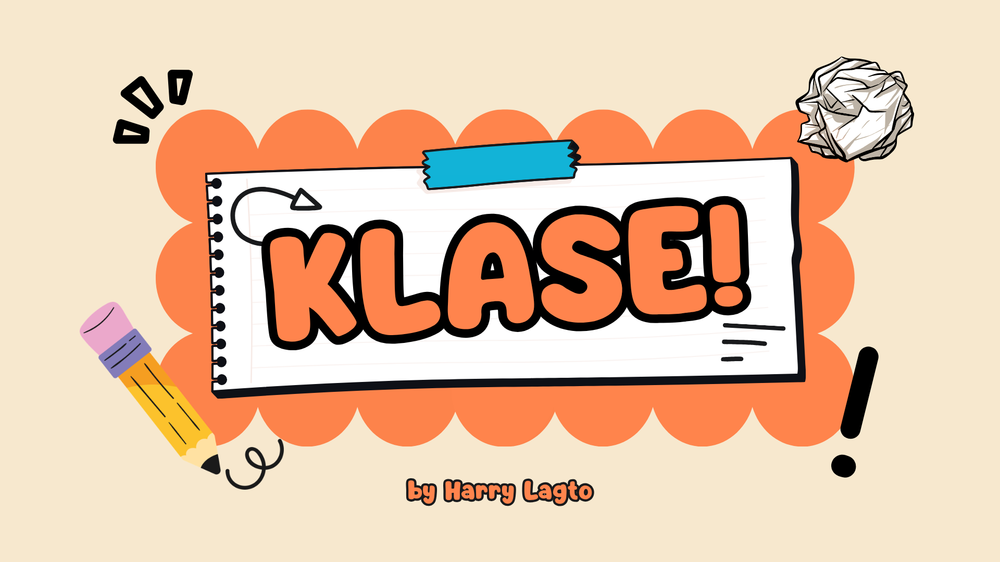

<div align="center">



<br />

# KLASE!

### A real-time 3D space hangout, right in your browser

<br />

**Entertainment** &nbsp;|&nbsp; **Harry Lagto** &nbsp;|&nbsp; Three.js &middot; Colyseus &middot; TypeScript &middot; Vite &middot; Node.js &middot; Supabase

[**Visit the live site**](https://klase-room.vercel.app)

</div>

<br />

## About the Project

| | |
|---|---|
| **Project title** | Klase |
| **Student name** | Harry Lagto |
| **Website category** | Entertainment (3D Space Hangout) |

Klase is a cozy 3D hangout space that runs entirely in the browser with no install. Pick a character, drop into a shared room, and walk around an isometric classroom built with Three.js. Sit on chairs, chat with people standing near you, and talk through proximity voice, the way you would in a small virtual campus.

Every room is kept in sync in real time by a Colyseus game server, so everyone sees the same movement, seats, and chat. An optional Supabase back end handles accounts, roles, and moderation, and an owner dashboard lets staff keep the space safe and friendly.

<br />

## Pages and Sections

| # | Page or section | What it does |
|:-:|---|---|
| 1 | **Game Menu** | Landing screen with Play, guest join, and Google or email sign in |
| 2 | **Onboarding** | Step by step intro, Terms, Privacy Policy, and a consent step with age and agreement checkboxes |
| 3 | **Character Selection** | Rotating 3D preview, character cards, and a display name input |
| 4 | **Room Select** | Lists the rooms with live capacity, and shows rooms full or locked messages |
| 5 | **3D Hangout Room** | Movement, sit and stand, proximity chat and voice, player list, on screen joystick on mobile |
| 6 | **Admin Dashboard** (`/admin`) | Account search, roles, bans, room locks, whitelist and passcodes, God mode |
| 7 | **Auth Callback** (`/auth/callback`) | Finishes Google sign in and sends the user back to the right page |

<br />

## Main Features

<table>
<tr>
<td width="50%" valign="top">

**Hangout**
- Real-time multiplayer with instant state sync
- Isometric 3D room with animated characters (idle, walking, sitting)
- Proximity text chat with the last 40 lines kept as history
- Proximity voice, with the mic off by default
- Character and display name remembered between visits
- Mobile friendly with an on screen joystick and Sit or Stand button

</td>
<td width="50%" valign="top">

**Safety and Accounts**
- Guest join, Google sign in, and email registration
- Consent checkboxes that gate the Play button
- Display name cleaning, profanity filter, and link redaction
- Owner, admin, and user roles enforced on the server
- Kick with message and cooldown, ban, global mute, local mute
- Admin dashboard with search, room locks, whitelist, and God mode
- Idle removal and a staff lockout after failed attempts

</td>
</tr>
</table>

<br />

## Controls

| Input | Action |
|---|---|
| `W` `A` `S` `D` or arrow keys | Move around the room |
| `E` | Sit or stand (Space also stands) |
| Joystick (phone or tablet) | Move, with a Sit or Stand button beside it |
| Mic button | Toggle proximity voice |
| Chat box | Talk to nearby players |
| Players menu | Mute locally, or kick, ban, mute, and promote if you are staff |

<br />

## Technologies Used

| Layer | Technologies |
|---|---|
| **Front end** | HTML, CSS, TypeScript (compiled to JavaScript), Vite, Three.js, lottie-web |
| **Real-time** | Colyseus and colyseus.js over WebSocket |
| **Back end** | Node.js 20, Express, REST API, `ws`, `cors`, `dotenv` |
| **Data and auth** | Supabase (PostgreSQL, Row Level Security, Google OAuth), Local Storage, Session Storage, JSON |
| **Browser APIs** | Fetch API, WebRTC and Web Audio (proximity voice), `getUserMedia`, DOM events |
| **Assets** | Draco compressed GLB 3D models, PNG, Lottie JSON |
| **Hosting** | GitHub, Vercel (website), Render (game server) |

<br />

## Project Structure

```text
client/   Web app: screens, 3D world, auth, admin dashboard
server/   Colyseus rooms, REST API, moderation, Supabase access
shared/   Constants and helpers used by both client and server
assets/   3D models, animations, textures, menu art
docs/     Project spec, UI style guide, database SQL
tools/    Scripts for compressing and converting character models
```

<br />

<div align="center">

Made by **Harry Lagto**

</div>
